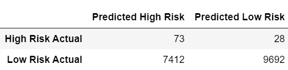

# Credit_Risk_Analysis

## Table of Contents
- [Overview of Project](#OverviewProject)
- [Results](#Results)
  * [Resolving Class Imbalance Models](#RCI)
    - [Random Oversampling](#RO)
    - [SMOTE Oversampling](#SMOTE)
    - [Undersampling](#US)
    - [Combiation of Oversampling and Undersampling](#COMB)
  * [Classifier](#RFC)
    - [Balanced Random Forest](#BRF)
    - [Balanced Random Forest Scaled](#BRFS)
    - [Easy Ensemble](#EE)
    - [Easy Ensemble Scaled](#EES)

- [Summary](#Summary)
- [Resources](#Resources)

## Overview of Project

We will be creating different models to evaluate credit risk from a group of data [[3]](#3). Given that applicants that are risky are significantly less than safe loans, we will be using different models with unbalanced classes. We will oversample, undersample, use a combination of both [[1]](#1) in addition to using other models such as random forests and ensemble learning [[2]](#2). We will evaluate which model or models give us more accurate results.

## Results

### Resolving Class Imbalances Models

In this subsection we will be evaluating the differences between oversampling, using SMOTE for oversampling, undersampling and using a combination of them [[1]](#1). Out data consists of 68,470 low-risk applicants and 347 high-risk applicants.  Given this, we will be mainly evaluating the model's performance with predicting high-risk applications.  To gather the low risk application predictions, look at the screenshots provided for each model. 
* **Original Counter** - Low risk 68,470 applicants & high risk 347 applicants.

#### Random Oversampling

  * **Counter** - Low risk 51,366 applicants & high risk 51,366 applicants.
  * **Balanced Accuracy Score** - 65.74%.
  * **Confusion Matrix** -  72 accurately predicted high risk, 29 inaccurately preducted high risk
  * **Classification Report** -  1%  high risk prescicion, 71% recall, 2% f1 score.  

In the random oversampling the model picked data from the already excisting high risk applicant data, and created extra entries of it. This is our picked model from the models as it had the best prediction when considering low and high risk data. 

  

 Figure 1: Random Oversampling Balanced Accuracy Score
 

  

 Figure 2: Random Oversampling Confusion Matrix
 

  

 Figure 3: Random Oversampling Classification Report Imbalanced
 

#### SMOTE Oversampling

  * **Counter** - Low risk 51,366 applicants & high risk 51,366 applicants.
  * **Balanced Accuracy Score** - 66.22%.
  * **Confusion Matrix** -  64 accurately predicted high risk, 37 inaccurately preducted high risk
  * **Classification Report** -  1%  high risk prescicion, 63% recall, 2% f1 score.  

In the SMOTE overrsampling the model generated more data by creating random points close to the already exhisting points on the high risk applicant data.

  

 Figure 4: SMOTE Oversampling Balanced Accuracy Score
 

  

 Figure 5: SMOTE Oversampling Confusion Matrix
 

  

 Figure 6: SMOTE Oversampling Classification Report Imbalanced
 

#### Undersampling

  * **Counter** - Low risk 246 applicants & high risk 246 applicants.
  * **Balanced Accuracy Score** - 54.42%.
  * **Confusion Matrix** -  70 accurately predicted high risk, 31 inaccurately preducted high risk
  * **Classification Report** -  1%  high risk prescicion, 69% recall, 2% f1 score.  

In the Undersampling the model reduced the amount of entries for both the low risk and high risk data points. It did so by using clustering of centroids algorithm. Of the models addressing the class imbalance, this model performed the worst at predicting low risk applicants which could be contributed to the loss of data points for this class. 

  

 Figure 7: Undersampling Balanced Accuracy Score
 

  

 Figure 8: Undersampling Confusion Matrix
 

  

 Figure 9: Unersampling Classification Report Imbalanced
 

#### Combination of Oversampling and Undersampling

  * **Counter** - Low risk 68,430 applicants & high risk 68,460 applicants.
  * **Balanced Accuracy Score** - 64.47%.
  * **Confusion Matrix** -  73 accurately predicted high risk, 28 inaccurately preducted high risk
  * **Classification Report** -  1%  high risk prescicion, 72% recall, 2% f1 score.  

In thecombination the model combined the undersampling and oversampling methods using the SMOTEEN algorithm. This model had the best performance for the high risk application recall of the models addressing the class imbalance. Yet it suffered from a slight loss in the low risk recall when compared to the random oversampling model. Therefore this will not be our pick. 

  

 Figure 10: Combination Sampling Balanced Accuracy Score
 

  

 Figure 11: Combination Sampling Confusion Matrix
 

  

 Figure 12: Combination Sampling Classification Report Imbalanced
 

### Classifier Models

In this subsection we will be evaluating boostrapping [[2]](#2). Out data consists of 68,470 low-risk applicants and 347 high-risk applicants.  Given this, we will be mainly evaluating the model's performance with predicting high-risk applications.  With the exceptions of the scaled models run, these models performed better than the ones used to address the class imbalance. 

#### Balanced Random Forest

  * **Balanced Accuracy Score** - 78.85%.
  * **Confusion Matrix** -  71 accurately predicted high risk, 30 inaccurately preducted high risk
  * **Classification Report** -  3%  high risk prescicion, 70% recall, 6% f1 score.  

This model randomly undersamples the model (as opposed to the random forest model) and uses bootstrapping to generate a model. We also evaluated which of the feature had the most weight, as seen in Figure 16.  

  

 Figure 13: Balanced Random Forest Balanced Accuracy Score
 

  

 Figure 14: Balanced Random Forest Confusion Matrix
 

  

 Figure 15: Balanced Random Forest Classification Report Imbalanced
 

  

 Figure 16: Balanced Random Forest Feature Importances
 

#### Balanced Random Forest Scaled

  * **Balanced Accuracy Score** - 50.0%.
  * **Confusion Matrix** -  101 accurately predicted high risk, 0 inaccurately preducted high risk
  * **Classification Report** -  1%  high risk prescicion, 100% recall, 1% f1 score.  

This model did not predict any low risk applicants. We ran this model to understand the difference in bias in the original data set and this scaled data set. Yet something in this model is not working properly and of all the models it performed the worst. We will need to look further in our documentation and code to understand what happened in this model. This model will not be considered. 

  

 Figure 17: Balanced Random Forest Scaled Balanced Accuracy Score
 

  

 Figure 18: Balanced Random Forest Scaled Confusion Matrix
 

  

 Figure 19: Balanced Random Forest Scaled Classification Report Imbalanced
 

  

 Figure 20: Balanced Random Forest Scaled Feature Importances
 

#### Easy Ensemble

  * **Balanced Accuracy Score** - 93.16%.
  * **Confusion Matrix** -  93 accurately predicted high risk, 8 inaccurately preducted high risk
  * **Classification Report** -  9%  high risk prescicion, 92% recall, 16% f1 score.  

Easy ensemble adaboost classifier uses training in order to get the model to improve its predictions. This model performed the best in accuracy, and in its ability to predict high risk precision. Therefore this model is our pick. We could say that this model could potentially suffer from overfitting, but we would not know this to be true unless we run additional data sets. 

  

 Figure 21: Easy Ensemble Accuracy Score
 

  

 Figure 22: Easy Ensemble Confusion Matrix
 

  

 Figure 23: Easy Ensemble Classification Report Imbalanced
 

#### Easy Ensemble Scaled

  * **Balanced Accuracy Score** - 61.5%.
  * **Confusion Matrix** -  57 accurately predicted high risk, 44 inaccurately preducted high risk
  * **Classification Report** -  1%  high risk prescicion, 56% recall, 2% f1 score.  

Running the scaled data into the easy ensemble classifier did not improve the models performance. Therefore this model will not be considered. 

  

 Figure 24: Easy Ensemble Scaled Balanced Accuracy Score
 

  

 Figure 25: Easy Ensemble Scaled Confusion Matrix
 

  

 Figure 26: Easy Ensemble Scaled Classification Report Imbalanced
 

##  Summary

In this case, we prefer models with higher recall percentages for the high-risk population than having good prescicion. It is better to incorrectly label low risk participants as high risk, and have further evaluation for them than to innacurately approve credit for people that are high risk with their credit.

From the models addressing the class imbalances we see that the combination sampling has the best high risk recall with 72%, yet compared to the other models it does not perform as well with the low risk recall having labeled 28 entries as false low risk cases. The random oversampling in this case has 71% of high risk recall (29 false low risk cases), yet the number of false high risk cases is 600 less than the one for the combination sampling. It would take additional resources to make the false risk cases be cleared as low risk. So in this case from the class imbalance models, the random oversampling is the most accurate. 

In the classifier models, we ran the models with scaled data as well as with the original data to understand their performance differences and biases. We found that the classifier models perform better with the original data sets. The balanced random forest performed particularly poorly with the scaled data, not predicting any data point as low risk. Although we would usually run the random forest with scaled data, we would have to do further documentation digging as to why the balanced forest works best with original data sets. 

Overall the classifier models perform better than the ones addressing the sample size. Of those, the Easy Ensemble AdaBoost Classifier performs the best predicting the high risk cases. There's a chance that this model could suffer from overfitting, but we wouldn't know this to be true untl we ran a different data set. At this point, Easy Ensemble AdaBoost Classifier is our pick.    

## Resources

<a name="1">[1]</a> [Loan Credit Risk Resampling Code](https://github.com/tamiespinosa/Credit_Risk_Analysis/blob/main/credit_risk_resampling.ipynb)

<a name="2">[2]</a> [Loan Credit Risk Ensemble Code](https://github.com/tamiespinosa/Credit_Risk_Analysis/blob/main/credit_risk_ensemble.ipynb)

<a name="3">[3]</a> [Loan Data](https://github.com/tamiespinosa/Credit_Risk_Analysis/blob/11852332e1ce9a54f127814a186441e0cd2dcf5c/Resources/LoanStats_2019Q1.csv)

[4] https://docs.github.com/en/get-started/writing-on-github/getting-started-with-writing-and-formatting-on-github/basic-writing-and-formatting-syntax
